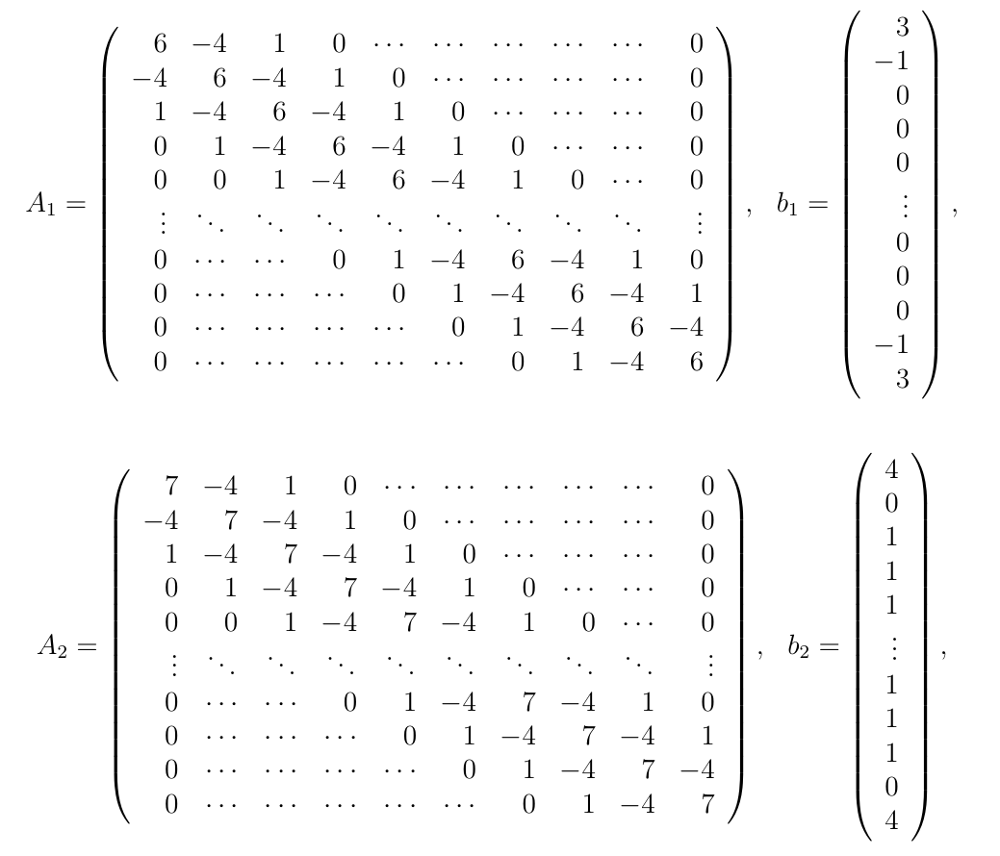

# Cholesky decomposition

## About
In this project, the Cholesky row decomposition method was implemented for solving the following linear systems:
  * _A_<sub>1</sub>_x_ = _b_<sub>1</sub>
  * _A_<sub>2</sub>_x_ = _b_<sub>2</sub>
 
where _A_<sub>1</sub>, _A_<sub>2</sub> &isin; &#8477;<sup>_n_,_n_</sup> and _b_<sub>1</sub>, _b_<sub>2</sub> &isin; &#8477;<sup>_n_</sup>:



In the context of this exercise, single-precision floating-point arithmetic was used in order to compare
the two linear systems in terms of precision, as _n_ takes value in {100, 1000, 10000}.

The purpose of this project was also to achieve the minimum time complexity for this specific form of input matrices
_A_<sub>1</sub>, _A_<sub>2</sub>, _b_<sub>1</sub> and _b_<sub>2</sub>.

## Implementation details
The project was implemented in both Octave and C language.

The C language version supports:
  * single and double-precision floating-point arithmetic by ```typedef```ing each time
```fptype``` to ```double``` or ```float```
  * optimal and non-optimal versions by defining or not preprocessor macro ```OPTIMIZED``` (see [Makefile](c/Makefile)).
