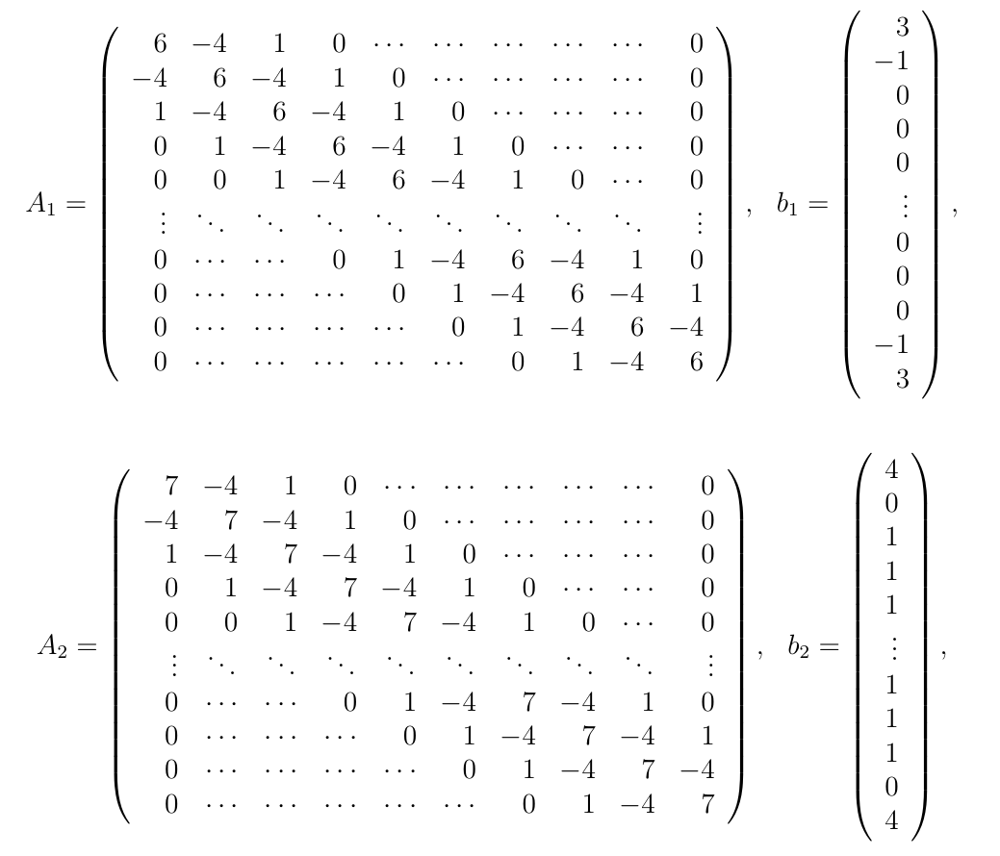
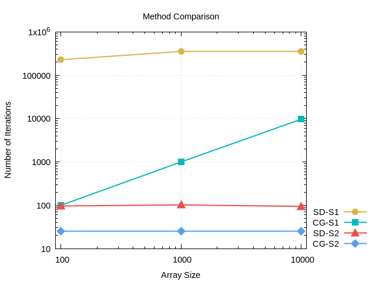

# Steepest Descent and Conjugate Gradients methods

## About
In this project, the Steepest Descent and Conjugate Gradients methods were implemented for solving the following linear systems:
  * _A_<sub>1</sub>_x_ = _b_<sub>1</sub>
  * _A_<sub>2</sub>_x_ = _b_<sub>2</sub>
 
where _A_<sub>1</sub>, _A_<sub>2</sub> &isin; &#8477;<sup>_n_,_n_</sup> and _b_<sub>1</sub>, _b_<sub>2</sub> &isin; &#8477;<sup>_n_</sup>:



In the context of this exercise, double-precision floating-point arithmetic was used in order to compare
the two linear systems in terms of convergence speed and the number of iterations required, as _n_ takes value in {100, 1000, 10000}. Moreover, provided that _r_<sup>(k)</sup> is the [residual](https://en.wikipedia.org/wiki/Residual_(numerical_analysis)) vector at the _k_-th step, the maximum residual should be ||_r_<sup>(k)</sup>|| &le; 0.5 * 10<sup>-4</sup>. 

The purpose of this project was also to achieve the minimum time complexity for this specific form of input matrices
_A_<sub>1</sub>, _A_<sub>2</sub>, _b_<sub>1</sub> and _b_<sub>2</sub>, taking into account that _A_<sub>1</sub> and _A_<sub>2</sub> are [pentadiagonal matrices](https://en.wikipedia.org/wiki/Pentadiagonal_matrix).

## Implementation details
The project was implemented in C language.

The C language version supports:
  * single and double-precision floating-point arithmetic by ```typedef```ing each time
```fptype``` to ```double``` or ```float```
  * optimal and non-optimal versions by defining or not preprocessor macro ```OPTIMIZED``` (see [Makefile](https://github.com/gzachos/nla-course-uoi/blob/master/set1/c/Makefile)).

## Results - Method Comparison



